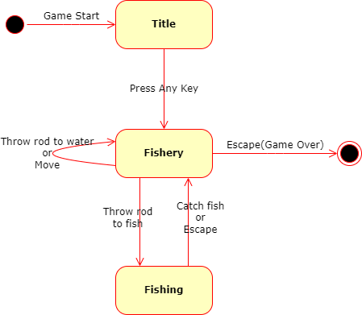
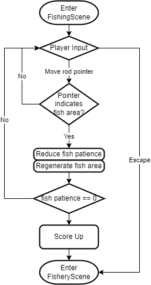

# FISHing

## 제작기간
24.07.18\
24.08.12 ~ 24.08.16

## 제작자
김형진(@KimSesame)

## 조작방법
  - A or Left arrow: 왼쪽으로 이동하기
  - D or Right arrow: 오른쪽으로 이동하기
  - Spacebar: 낚싯대 던지기
  
## 목표
  최대한 많은 물고기를 낚아올리기

## 프로그램 구조도
### Scene 변화 상태 다이어그램
- 각 씬에서 플레이어의 조작에 따라 씬이 변화합니다.\

### Controller 클래스 다이어그램
- 씬 마다 알맞은 `Controller`로 변경하고 해당 `Controller`로 조작을 진행합니다.\

### 낚시 페이즈 순서도
- 플레이어는 물고기를 따라다니며 물고기의 인내심을 감소시킬 수 있습니다.
- 낚시 페이즈에 진입하면 플레이어가 포기하거나 낚시에 성공할 때까지 다음을 반복합니다.
  - 플레이어 입력
  - 물고기의 인내심 판별\
